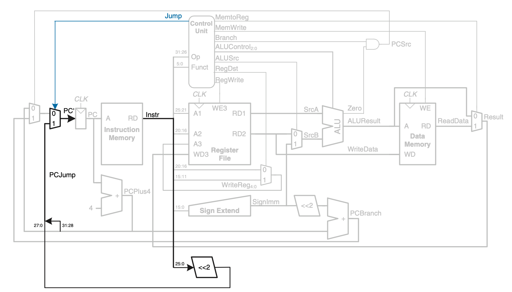
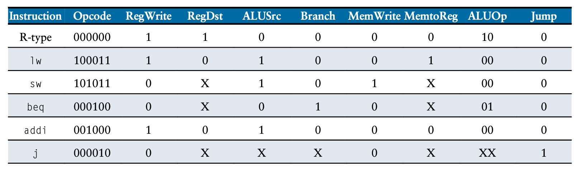

## Single Cycle MIPS CPU
This is my single cycle implementation of a basic MIPS cpu. The supported op codes are listed below. 

### What is Single Cycle?
A single cycle CPU is essentially purely combinational from the datapath and control unit perspective. It only takes one clock cycle for an instruction to execute. To put it another way, one instruction cycle equals one clock cycle.

#### Advantages and Disadvantages

Advantages: 
* Single cycle CPUs are relatively simple to implement as they are just combinational logic and registers.
* This means they are low cost and require little space. 

Disadvantages:
* Being able to able to complete an instruction in one cycle is a double edged sword.
* The clock has a limited frequency by setup and hold timing requirements of the large amount of combinational logic
* Clock tends to be quite slow making this design less desirable in modern CPUs

### Supported Operations

* R-type (add, subtract, or, and, less than)
* Load word (lw)
* Save word (sw)
* Branch on equal (beq)
* Add intermediate (addi)
* Jump (j)

### Block Diagram

### Control Unit

The control unit orchestrates the data path. Based on the current instruction it will use combinational logic to control various elements in the datapath to route information according to what the instruction needs. By the nature of a single cycle CPU the control unit can be purely combinational as an instruction is complete within the clock cycle. 

